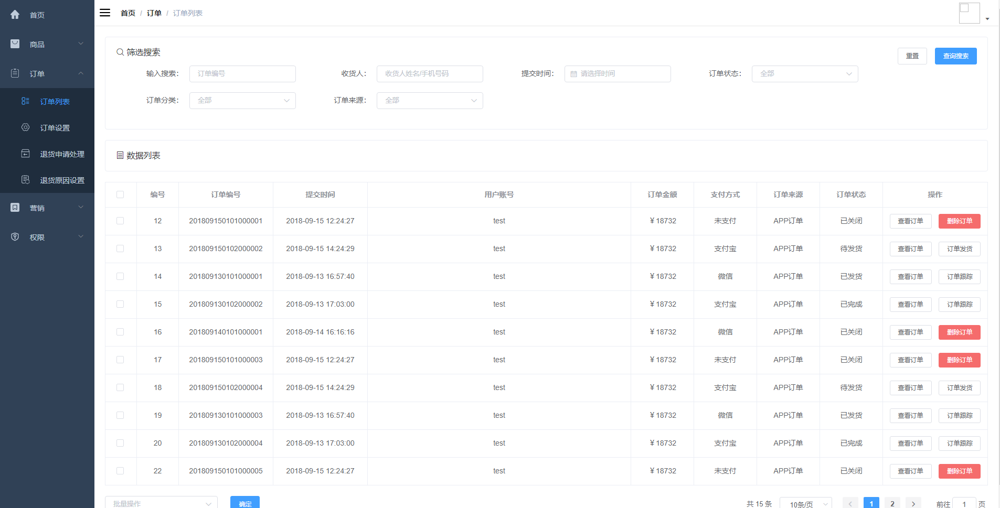

# mall-swarm-istio

mall-swarm改造版，用于适配k8s和istio的测试使用，仓库直接包含了mall-swarm库和mall-admin-web库，这个分支主要是为了测试solarmesh对eureka服务的支持

## 改动

mall-swarm:

1. 为了方便测试，所有k8s的yaml统一去掉了挂载，改为deployment，并添加了所有中间件的yaml，可以一起apply到集群里面
2. 代码去掉了nacos的依赖，改为使用eureka服务发现机制

mall-admin-web:

改动了BASE_API，需要使其指向集群内的gateway服务

## 使用方法

### 前置条件

* k8s集群
* 安装istio

### 创建namespace

```bash
kubectl create ns mall
```

### 部署基础设施

```bash
kubectl apply -n mall -f mall-swarm/document/k8s/infra
```

### 导入sql

连接集群 nodeport 33066端口上的mysql，导入 mall-swarm/document/sql 下面的sql文件

### 部署mall-swarm

```bash
kubectl create ns mall
kubectl apply -n mall -f mall-swarm/document/k8s/service
```

### 接入sidecar

将 `gateway`，`mall-admin`，`mall-auth`，`mall-portal`，`mall-monitor`，`mall-search` 服务接入sidecar

### 注册

访问 http://{cluster-master-ip}:30201/doc.html

选择用户注册接口，注册一个账号

> ps: 最好改动一下数据库 ums_admin_permission_relation 表，给这个账号赋予一下超管权限

### 部署mall-admin-web

mall-admin-web推荐本地启动，config/dev.env.js配置到集群内的gateway服务

访问mall-admin-web的页面即可


